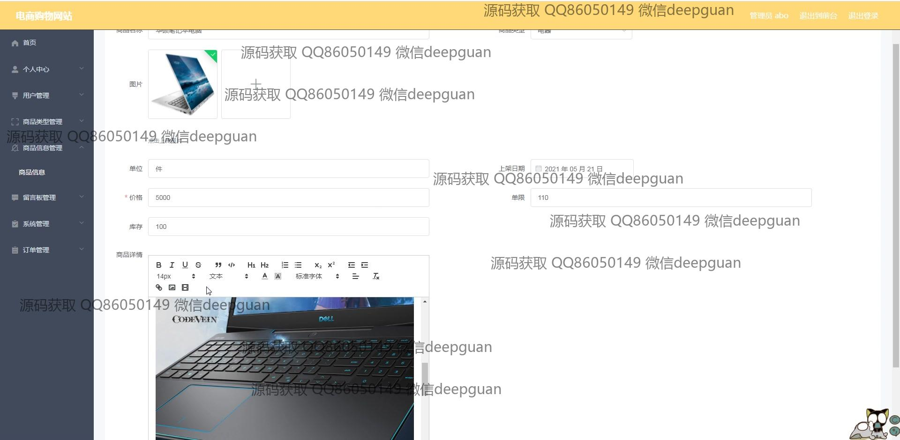
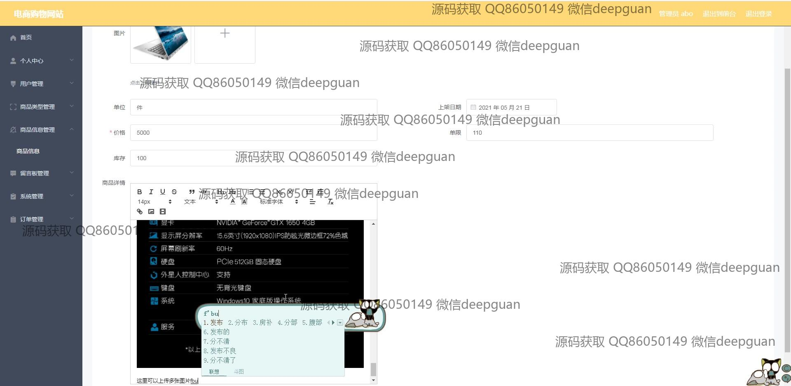
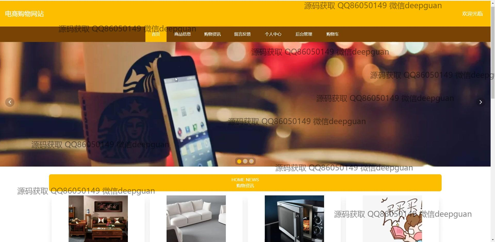
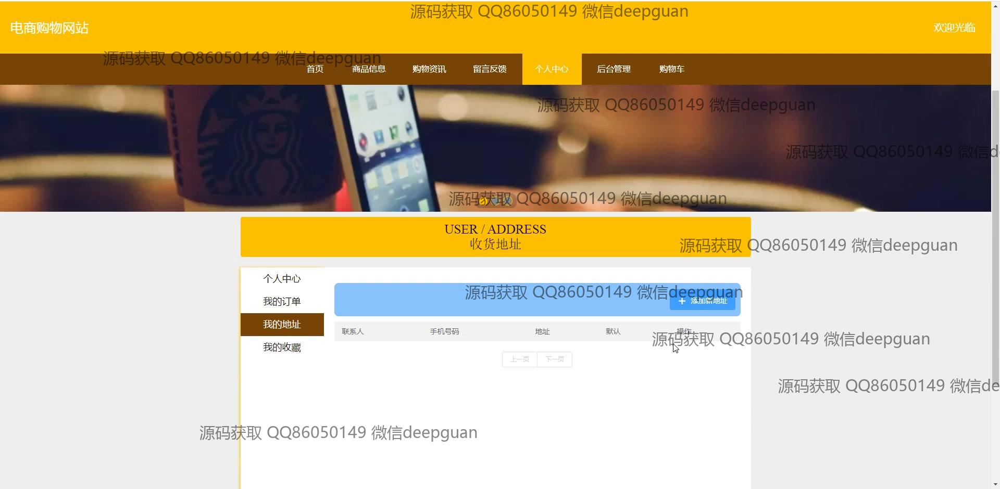
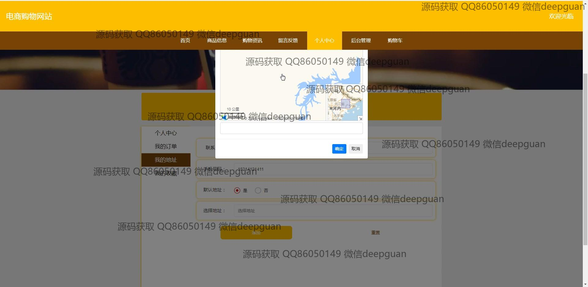
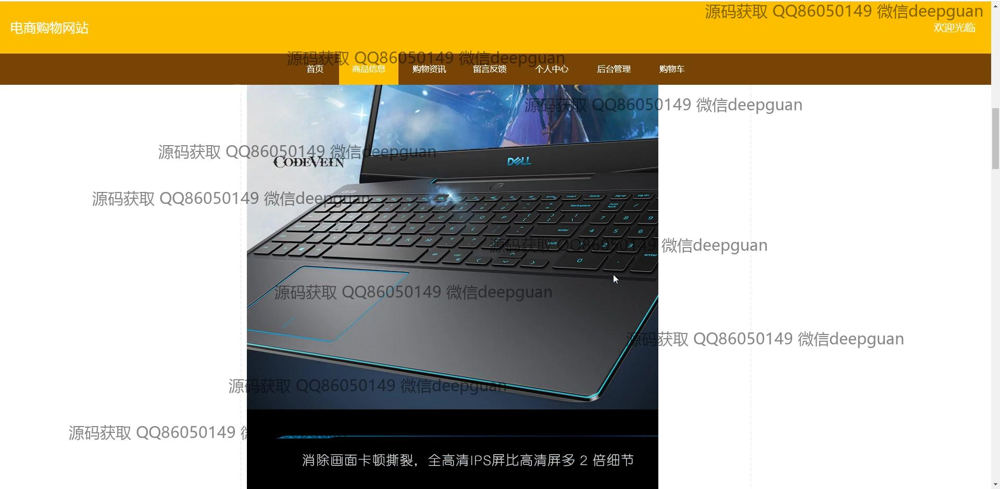
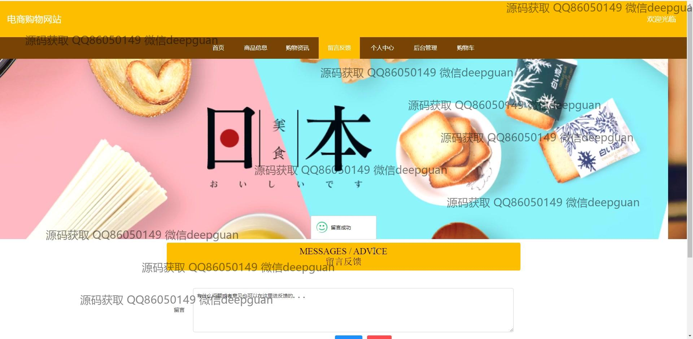

<h1 align="center">基于vue的电商购物网站+vue</h1>

## 简介
基于Vue的电商购物网站：角色分为管理员、用户；包括商品管理、订单管理、用户管理、评论管理、支付功能等。用户界面友好，后台功能完善，适合毕业设计项目展示。    --计算机毕业设计源码；毕设源码；java毕业设计源码

## 联系方式

<h3 align="center">获取完整代码与数据库文件 + 微信：deepguan QQ: 86050149 QQ群: 783742310</h3>

<h3 align="center">可帮忙远程部署 包运行成功！提供远程部署、修改代码、设计文档指导、代码讲解等服务！</h3>

## 功能介绍（完整见运行截图）
管理员：提供全面的后台管理功能，包括用户管理、商品信息管理、订单管理、留言板管理和系统管理。具备管理商品内容的能力，如上传图片、编辑商品详情和库存。支持对客户评论的回复和管理，处理用户反馈，提高用户体验。

用户：具备基本网站功能，如注册、登录和个人信息管理。可以浏览网站首页、查看商品信息和购物资讯，进行商品搜索和购买。支持添加商品到购物车、进行结算和选择多种支付方式。用户中心允许管理个人信息、地址和订单，以及查看购物历史。

前台功能：网站界面简洁明了，提供导航栏便捷访问主要模块，包括首页、商品信息、购物资讯和个人中心。支持动态内容加载，如广告展示和商品分类浏览。具备商品搜索栏和分类按钮，方便用户按需浏览商品。 

支付功能：提供用户多种支付选项，如微信支付、支付宝等，以便账户充值和下单支付，确保用户支付过程的便捷和安全。

## 运行截图

本代码来源于网络,仅供学习参考使用!

